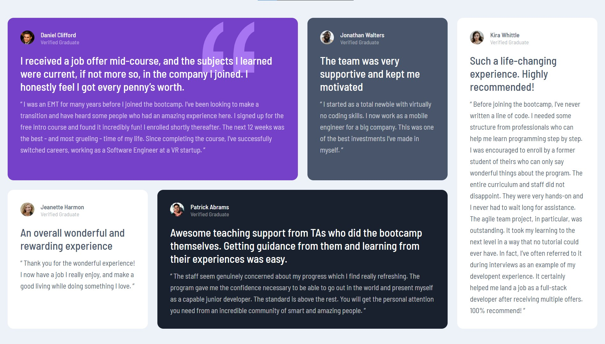

# Frontend Mentor - Testimonials grid section solution

This is a solution to the [Testimonials grid section challenge on Frontend Mentor](https://www.frontendmentor.io/challenges/testimonials-grid-section-Nnw6J7Un7). Frontend Mentor challenges help you improve your coding skills by building realistic projects. 

## Table of contents

- [Overview](#overview)
  - [The challenge](#the-challenge)
  - [Screenshot](#screenshot)
  - [Links](#links)
- [My process](#my-process)
  - [Built with](#built-with)
  - [What I learned](#what-i-learned)
- [Author](#author)

**Note: Delete this note and update the table of contents based on what sections you keep.**

## Overview

### The challenge

Users should be able to:

- View the optimal layout for the site depending on their device's screen size

### Screenshot

### Links

- Solution URL: [Github](https://github.com/chinyereunamba/testimonial-component)
- Live Site URL: [View site](https://earnest-82283d.netlify.app/)

## My process

### Built with

- Semantic HTML5 markup
- CSS custom properties
- Flexbox
- CSS Grid
- Mobile-first workflow

**Note: These are just examples. Delete this note and replace the list above with your own choices**

### What I learned

I learned to CSS Grid. I usually stick to CSS Flexbox but the Grid Layout is also a great way to design websites involving a lot of columns.
## Author

- Frontend Mentor - [@chinyereunamba](https://www.frontendmentor.io/profile/chinyereunamba)
- Twitter - [@esther_unamba](https://www.twitter.com/esther_unamba)

## Acknowledgments

I would like to thank [Scrimba](https://scrimba.com) and Per Harald Borgen for creating the CSS Grid Course. He helped me understand CSS Grid. 
They have tutorials on frontend development. 
